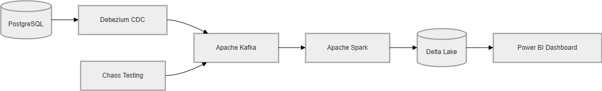
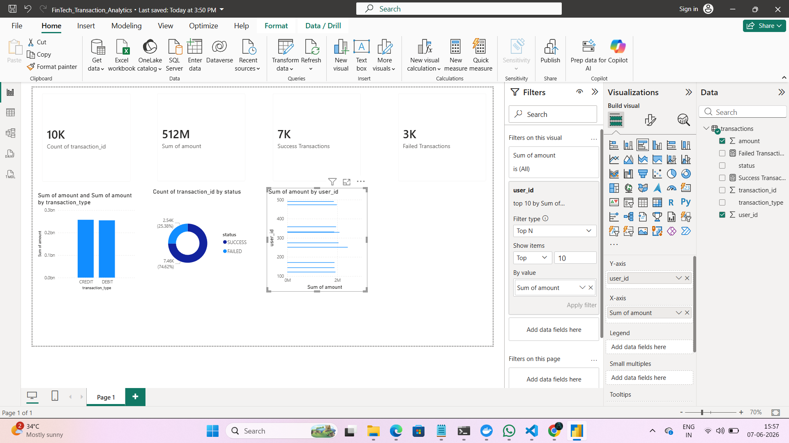
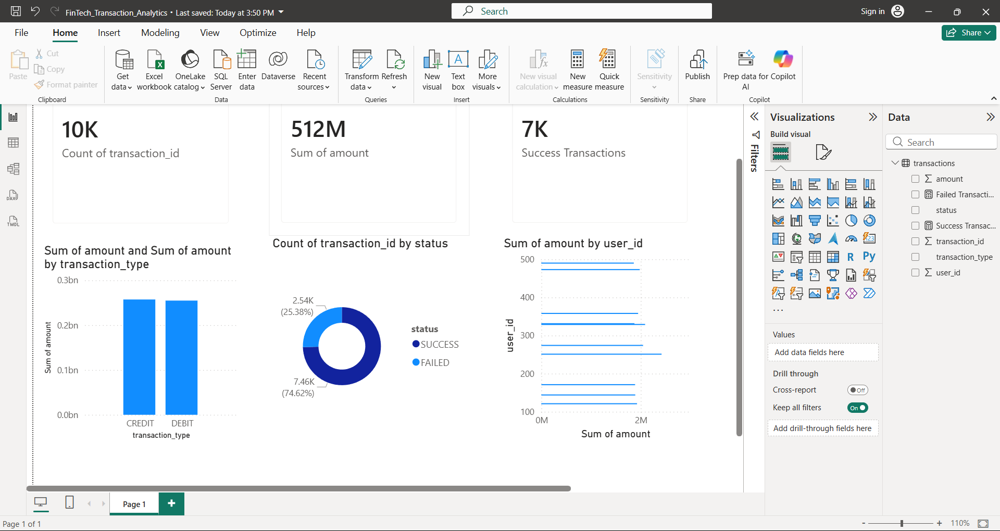

# CDC Financial Ledger

## Real-Time Financial Transaction Analytics Pipeline

An end-to-end Data Engineering project that captures financial transaction changes from PostgreSQL using Change Data Capture (CDC), streams events through Apache Kafka, processes data with Apache Spark, stores analytical datasets in Delta Lake, and visualizes business insights using Power BI.

---

## Project Overview

Financial institutions generate thousands of transactions every second. Traditional batch-processing systems cannot provide real-time visibility into transaction activity, failures, and business metrics.

This project demonstrates a modern real-time data pipeline that:

* Captures database changes using Debezium CDC
* Streams events through Apache Kafka
* Processes data using Apache Spark
* Stores analytical data in Delta Lake
* Visualizes insights through Power BI dashboards
* Includes chaos testing for reliability validation

---

## Architecture



### Data Flow

PostgreSQL → Debezium CDC → Apache Kafka → Apache Spark → Delta Lake → Power BI

---

## Dashboard

### Overview



### Analytics Charts



---

## Technology Stack

| Layer              | Technology    |
| ------------------ | ------------- |
| Database           | PostgreSQL 16 |
| CDC                | Debezium      |
| Streaming Platform | Apache Kafka  |
| Data Processing    | Apache Spark  |
| Data Storage       | Delta Lake    |
| Visualization      | Power BI      |
| Containerization   | Docker        |
| Language           | Python        |
| Version Control    | Git & GitHub  |

---

## Key Features

### Real-Time Change Data Capture

* Captures INSERT, UPDATE, and DELETE operations from PostgreSQL
* Streams database changes without impacting production workloads

### Event Streaming

* Apache Kafka acts as the central event bus
* Supports scalable and fault-tolerant streaming

### Data Processing

* Spark processes transaction events
* Supports future transformations and aggregations

### Analytics Dashboard

Provides:

* Total Transactions
* Total Transaction Volume
* Success Transaction Count
* Failed Transaction Count
* Transaction Type Distribution
* User Transaction Analysis
* Transaction Status Analysis

### Chaos Engineering

Includes reliability testing scripts to simulate failures and validate system resilience.

---

## Project Structure

```text
cdc-financial-ledger/
│
├── data/
│   ├── transactions.csv
│   └── transactions_large.csv
│
├── docker/
│   ├── docker-compose.yml
│   ├── postgres-connector.json
│   └── generate_data.py
│
├── docs/
│   ├── architecture.md
│   ├── architecture.png
│   ├── FinTech_Transaction_Analytics.pbix
│   └── images/
│       ├── dashboard-overview.png
│       └── dashboard-charts.png
│
├── postgres/
│
├── producer/
│   ├── producer.py
│   ├── consumer.py
│   └── chaos_test.py
│
├── spark/
│   └── kafka_to_delta.py
│
├── README.md
│
└── generate_data.py
```

---

## Setup Instructions

### Clone Repository

```bash
git clone https://github.com/<your-username>/cdc-financial-ledger.git

cd cdc-financial-ledger
```

### Start Infrastructure

```bash
cd docker

docker compose up -d
```

### Verify Containers

```bash
docker ps
```

Expected services:

* PostgreSQL
* Zookeeper
* Kafka
* Kafka Connect
* Spark

---

## Generate Sample Data

```bash
python generate_data.py
```

This creates:

* transactions.csv
* transactions_large.csv

with thousands of synthetic financial transactions.

---

## CDC Validation

Insert a transaction into PostgreSQL:

```sql
INSERT INTO transactions
(user_id, amount, transaction_type, status)
VALUES
(555, 25000, 'CREDIT', 'SUCCESS');
```

Debezium automatically captures the change and publishes it to Kafka.

---

## Business Metrics

### KPIs

* Total Transactions
* Total Transaction Value
* Success Rate
* Failure Rate

### Visualizations

* KPI Cards
* Bar Charts
* Pie Charts
* Donut Charts

---

## Chaos Testing

Run chaos testing scripts to validate pipeline resilience:

```bash
python producer/chaos_test.py
```

---

## Future Enhancements

* Real-time Spark Structured Streaming
* Airflow Orchestration
* Cloud Deployment (AWS/Azure/GCP)
* Data Quality Monitoring
* ML-based Fraud Detection
* Grafana Monitoring
* Kubernetes Deployment

---

## Resume Highlights

Built an end-to-end real-time data engineering pipeline using PostgreSQL, Debezium CDC, Apache Kafka, Spark, Delta Lake, Docker, and Power BI. Processed and analyzed 10,000+ financial transactions while implementing real-time streaming, analytics dashboards, and chaos engineering for reliability testing.

---

## Author

Preethi Beri

B.Tech – Computer Science and Data Science

Data Engineering | Data Analytics | Machine Learning

GitHub: https://github.com/preethi-beri
